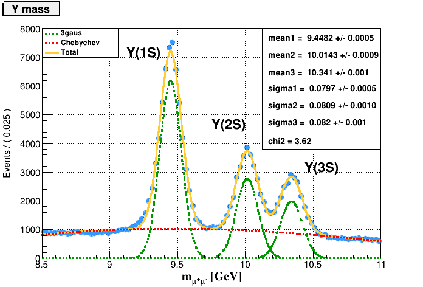
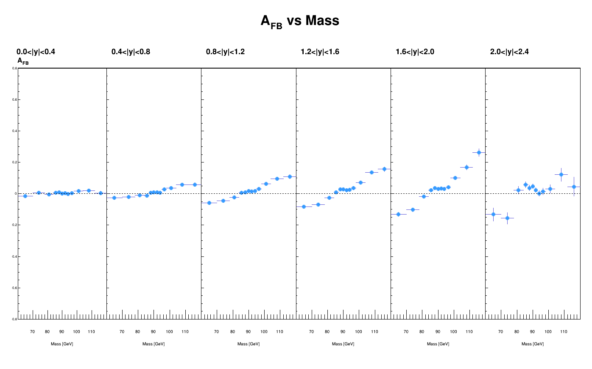

# dimuon_invm

Il pacchetto propone due analisi differenti su dati di tipo NanoAOD:
* **dimuon_invm**: Seleziona le coppie di muoni con carica opposta al fine di riprodurre le risonanze nello spettro di massa dei dimuoni. Per ciascuna risonanza è possibile riprodurre plot di impulso trasverso, pseudorapidità e angolo azimutale e fare un fit del picco per ricavare il valore della sua massa e della sua larghezza.

E.g. per Y(1S,2S,3S):

* **Z_asymmetry**: Seleziona coppie di muoni che passano una particolare selezione (referenza: [link](https://arxiv.org/abs/1806.00863)) e riproduce il plot della Forward-Backward asymmetry in sei diversi range di rapidita'.

E.g. per Run2012B-C_SingleMu:

