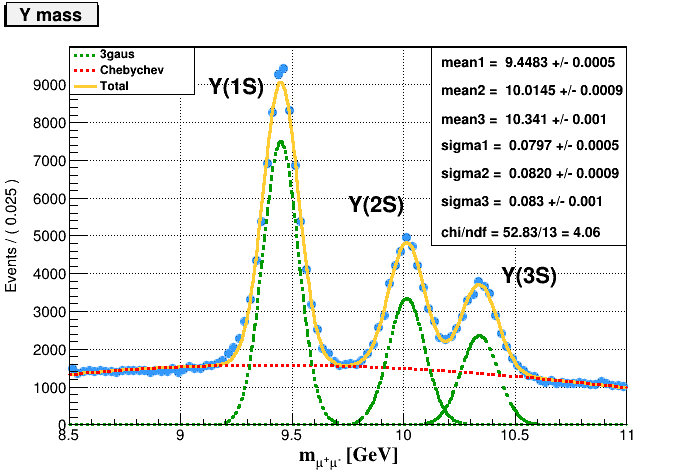

# dimuon_invm

Il pacchetto propone due analisi differenti su dati di tipo NanoAOD:
* **dimuon_invm**: Seleziona le coppie di dimuoni con carica opposta al fine di riprodurre le risonanze nello spettro in massa dei dimuoni. Per ciascuna risonanza è possibile riprodurre plot di impulso trasverso, pseudorapidità e angolo azimutale e fare un fit del picco per ricavare il valore della massae della sezione d'urto. Risoluzione?
(Usa nanoAOD_DoubleMu_Parked)

E.g. for the Y(1S,2S,3S):

* **Z_asymmetry**: Seleziona coppie di muoni che passano una particolare selezione (referenza: [link](https://arxiv.org/abs/1806.00863)) e riproduce il plot della Forward-Backward asymmetry in sei diversi range di rapidita'.

E.g. for data of Run2012B-C_SingleMu:

